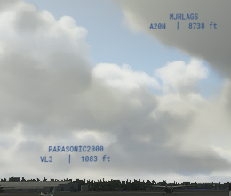
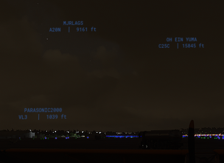
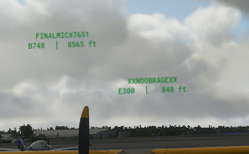
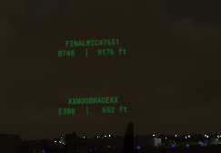
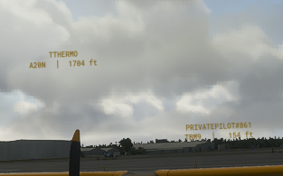
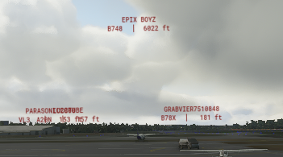
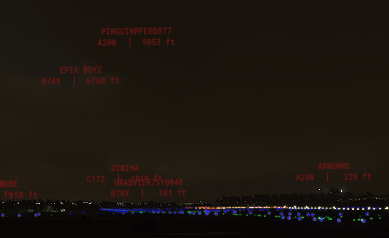
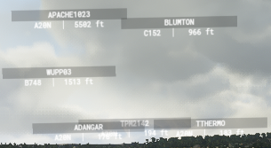
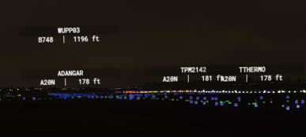

# MSFS modified traffic nameplates
Summary of modifications to make the traffic nameplates in Microsoft Flight Simulator 2020 smaller and less intrusive.

Changes include:
- different colors to choose from (see preview screenshots below)
- reduced fontsize
- font is changed to a more readable one (Roboto)
- removed useless margins/paddings
- some variants have no dark background
- a thin white shine around the text to make it readable at night

v2 version also includes:
- Letter spacing on the name to make it more readable
- dark background but reduced to width of name and rounded corners
- Disabled display of aircraft type and origin airport, so only altitude is shown if provided by the sim

## Installation
Download the release/zip file.
Place the folder of one(!) desired variant of the nameplates in your "Community" folder.
A restart of MSFS is required to see the effect.

## Known issues
After a patch for MSFS, the sim not immediately loads the Community folder, so one or more restarts are required. This applies on all mods, not this one in particular.
MSFS patch 1.8.3.0 introduced some bug which hides details on nameplates randomly. Sometimes switching the Graphics settings for "generic" models to on/off restores the details.

## Uninstallation
Simply delete the folder from your "Community" folder.

## Previews

### cppr-nameplates-v2-green

## Previews for older versions still included

### cppr-nameplates-small-blue

### cppr-nameplates-small-green

### cppr-nameplates-small-orange

### cppr-nameplates-small-red

### cppr-nameplates-small-original

## Changelog

### v2.0
- Added new v2 version (only green available) with better readability.

### v1.1
- Updated the version to work with MSFS patch 1.7.14.0

### v1.0
- Initial version